# Cloudflare Edge Caching Summary for Quran.com

> **Document Purpose**: Engineer-friendly summary of how the Cloudflare Snippet
> (`qdc-ssr-edge-cache.js`) implements edge caching on `ssr.quran.com`.

---

## 🎯 Core Objective

Make **SSR (Server-Side Rendering) personalization first-class** while still leveraging **edge
caching**. The snippet ensures:

- Fast page loads for **both guests and logged-in users**
- **No private data leakage** between users
- Respects QF-318's rules (device language + country-based defaults)

---

## 🏗️ High-Level Architecture


---

## ✅ What the Snippet Caches (and what it ignores)

The snippet only runs its caching logic for **GET** requests on `ssr.quran.com`, and only for:

1. **HTML document navigations** (SSR HTML)
   - Detected via `Sec-Fetch-Dest: document`, `Accept: text/html`, **or** path-based fallback (if
     the path looks like a page and is not an asset/API/internal route, it's treated as HTML).
   - This fallback ensures crawlers/monitors without proper headers still use the cache.
   - Cached via Cloudflare’s built-in cache using
     `fetch(..., { cf: { cacheEverything, cacheKey } })`.
   - **Origin redirects (3xx) are not cached** in this path (`301-308: 0`).
2. **Safe locale redirects** (e.g. `/` → `/vi`, manual locale redirects)
   - Cached via `caches.default` using a `__qdc_t=redir` cache key (24h TTL).
3. **Next.js data requests** (`/_next/data/*`)
   - Cached via `caches.default` using `__qdc_t=data` (1h TTL).
4. **Allowlisted public content API endpoints**
   - Cached via `caches.default` using `__qdc_t=api` (TTL from origin `max-age` when `public`, else
     default 24h).

Everything else is **pass-through** (no caching headers added by the snippet).

---

## 📋 The 6 Main Caching Scenarios

### Scenario 1: Guest User — First Visit (No Cookies)

```mermaid
sequenceDiagram
    participant Browser
    participant CF as Cloudflare Edge
    participant Origin as Next.js SSR

    Browser->>CF: GET /vi/5
    Note over CF: No QDC_PREFS_KEY cookie
    Note over CF: Detect: Accept-Language=vi, Country=VN

    CF->>CF: Build cache key:<br/>URL + locale(vi) + deviceLang(vi) + country(US*)

    Note over CF: *QF-318: Non-English → country=US

    CF->>Origin: Cache MISS → fetch from origin
    Origin-->>CF: HTML (SSR with defaults)
    CF->>CF: Store in edge cache (1h TTL)
    CF-->>Browser: HTML + X-QDC-Edge-Cache: MISS

    Note over Browser: Next request with same bucket → HIT
```



| Aspect                 | Details                                                                                                                     |
| ---------------------- | --------------------------------------------------------------------------------------------------------------------------- |
| **Inputs detected**    | Device language (`Accept-Language`), Country (CF IP geolocation)                                                            |
| **Cache key includes** | URL + `localeForPreferences` + `countryForPreferences`                                                                      |
| **Result**             | First request is a **MISS** → origin renders HTML with country/language defaults → cached for future users in same "bucket" |
| **QF-318 Rule**        | English → use real country. Non-English (supported) → use `US` as country.                                                  |

---

### Scenario 2: Returning Guest — Has Preferences Cookie


| Aspect                 | Details                                                                                |
| ---------------------- | -------------------------------------------------------------------------------------- |
| **Inputs detected**    | `QDC_PREFS_KEY` cookie (hash of user's preference set)                                 |
| **Cache key includes** | URL + locale + `prefsKey`                                                              |
| **Result**             | Anyone with the **same preference hash** shares the same cached HTML → higher hit rate |
| **Why?**               | Preferences (font size, translations, etc.) are bucketed into a short hash.            |

---

### Scenario 3: Logged-In User — Private Page


| Aspect                 | Details                                                     |
| ---------------------- | ----------------------------------------------------------- |
| **Inputs detected**    | `id` cookie (user session) → hashed to `userKey`            |
| **Cache key includes** | URL + locale + `prefsKey` **or** guest bucket + **`userKey`** |
| **Result**             | Each user gets **isolated cache entries** → no data leakage |
| **Bypass rule**        | If `userKey` can't be determined → **bypass entirely**      |

**Private paths include:**

- `/collections`
- `/profile`
- `/notes-and-reflections`
- `/reading-goal`
- `/notification-settings`
- `/my-learning-plans`
- `/my-quran`
- `/take-notes`

> Note: `/complete-signup` is in the snippet’s **bypass** list (it’s auth-adjacent), so it is not
> cached even though it may be user-specific.

---

### Scenario 4: Manual Locale Override


| Aspect                    | Details                                                                          |
| ------------------------- | -------------------------------------------------------------------------------- |
| **Detection**             | `QDC_MANUAL_LOCALE=1` cookie is set                                              |
| **Behavior**              | User's explicit locale choice takes precedence over device language              |
| **Edge redirect caching** | Redirects like `/` → `/vi` are cached at the edge (24h TTL)                      |
| **Cache key**             | Includes `manualLocale` flag to bucket manual vs. auto-detected users separately |

---

### Scenario 5: Next.js Data Requests


| Aspect                 | Details                                                                         |
| ---------------------- | ------------------------------------------------------------------------------- |
| **What these are**     | JSON payloads fetched during client-side navigation (SPA transitions)           |
| **Caching mechanism**  | Uses `caches.default` (Cloudflare Cache API)                                    |
| **Cache key includes** | Same bucketing as HTML: locale + prefs/guest bucket + userKey for private pages |
| **TTL**                | 1 hour                                                                          |
| **Safety**             | `Set-Cookie` headers stripped before caching                                    |

---

### Scenario 6: Public Content API Caching


| Aspect                    | Details                                                                                                                                                                         |
| ------------------------- | ------------------------------------------------------------------------------------------------------------------------------------------------------------------------------- |
| **Allowlisted endpoints** | `/api/proxy/content/api/qdc/verses/by_chapter/*`<br/>`/api/proxy/content/api/qdc/resources/translations`<br/>`/api/proxy/content/api/qdc/resources/country_language_preference` |
| **Path matching rule**    | Exact endpoint match by default; only prefixes ending in `/` are treated as wildcard subpaths. This prevents accidental cache inclusion for similarly named routes.            |
| **Caching mechanism**     | `caches.default` with URL-based cache key                                                                                                                                       |
| **TTL**                   | Respects origin's `max-age` if present, otherwise 24 hours (capped at 30 days)                                                                                                  |
| **Safety**                | `Set-Cookie` stripped (origin sometimes sends irrelevant cookies)                                                                                                               |
| **Requirement**           | Origin must return `Cache-Control: public` — otherwise **BYPASS**                                                                                                               |

---

## 🚫 Request-Level Bypass Rules (Always Pass-Through)


| Route/Condition                                                                                                 | Why                                                                            |
| --------------------------------------------------------------------------------------------------------------- | ------------------------------------------------------------------------------ |
| **Auth/bypass routes**: `/auth`, `/login`, `/logout`, `/complete-signup`, `/forgot-password`, `/reset-password` | Security — never cache login/logout or auth-adjacent flows                     |
| **Token queries**: `?token=...`, `?code=...`, `?redirectBack=...`, `?redirect_to=...`, `?visitedPlatform=...`   | OAuth/SSO flows — unique per request                                           |
| **Non-GET requests**                                                                                            | Snippet caching is only applied to `GET`                                       |
| **Private pages without valid user session**                                                                    | Can't generate `userKey` → bypass to avoid caching intermediate states         |
| **Non-cacheable request types**                                                                                 | Only HTML documents, `/_next/data/*`, and allowlisted content APIs are handled |
| **Static assets** (`.js`, `.css`, `.png`, etc.)                                                                 | Handled by Cloudflare's default caching, not this snippet                      |

> Response-level rules also apply for the cacheable types (e.g. JSON must be `application/json`,
> allowlisted APIs must be `Cache-Control: public`, unsafe `Set-Cookie` can force a BYPASS for
> `/_next/data`, and cached JSON responses have `Set-Cookie` stripped).

---

## 🔑 Cache Key Components


| Component  | Used For                              | Example Value          |
| ---------- | ------------------------------------- | ---------------------- |
| `__qdc_v`  | Cache version (for emergency busting) | `3`                    |
| `__qdc_l`  | Explicit locale from URL              | `vi`                   |
| `__qdc_p`  | Preferences hash (`QDC_PREFS_KEY`)    | `abcd123`              |
| `__qdc_d`  | Device language (guest fallback)      | `en`                   |
| `__qdc_c`  | Country (guest fallback)              | `US`                   |
| `__qdc_u`  | User hash (private pages only, even without prefsKey) | `k7x9p2m`              |
| `__qdc_t`  | Request type                          | `redir`, `data`, `api` |
| `__qdc_m`  | Manual locale flag                    | `1`                    |
| `__qdc_ml` | Manual locale value                   | `vi`                   |

---

## 📊 Response Headers for Debugging

| Header                 | Values                  | Meaning                                                             |
| ---------------------- | ----------------------- | ------------------------------------------------------------------- |
| `X-QDC-Edge-Cache`     | `HIT`, `MISS`, `BYPASS` | Whether our snippet served from cache                               |
| `X-QDC-Edge-Cache-Key` | Full cache key URL      | What key was used for bucketing                                     |
| `CF-Cache-Status`      | `HIT`, `MISS`, etc.     | Cloudflare's built-in cache status (HTML fetch path)                |
| `Age`                  | seconds                 | Cache age (HTML fetch path; not expected for `caches.default` hits) |

---

## 💡 Key Engineering Decisions

### 1. Preference Bucketing via `QDC_PREFS_KEY`

Instead of hashing all preferences on every request, the **client sends a pre-computed hash**. Users
with identical settings share cache entries.

```
User A: font=16, translation=en.hilali → QDC_PREFS_KEY=abc123
User B: font=16, translation=en.hilali → QDC_PREFS_KEY=abc123  ← Same cache!
User C: font=18, translation=en.hilali → QDC_PREFS_KEY=def456  ← Different cache
```

### 2. QF-318 Country Logic

| Device Language           | Country Used for Preferences      |
| ------------------------- | --------------------------------- |
| English                   | Real country (e.g., US, EG, PK)   |
| Non-English (supported)   | Always `US`                       |
| Non-English (unsupported) | Real country (treated as English) |

**Why?** English users get country-specific defaults (e.g., Egyptian users get Arabic translation).
Non-English users already indicated their language preference, so country doesn't matter for
defaults.

### 3. Redirect Caching

Locale redirects (e.g., `/` → `/vi` for Vietnamese users) are **cached at the edge for 24 hours**,
avoiding repeated origin round-trips for the same bucket.

### 4. Avoid Caching Origin 3xx (HTML)

For HTML navigations we intentionally **do not cache origin redirects** (`301-308: 0`). This
prevents redirect poisoning/loops (e.g., default-locale canonicalization redirects like `/en/1` →
`/1` interacting with locale routing at the edge).

### 5. No Workers Required

Uses **Cloudflare Snippets only**, which is cheaper and simpler to deploy than full Workers.

### 6. Trailing Slash Normalization

`/vi/` → `/vi` happens at the edge (308 redirect) to avoid duplicate cache entries.

---

## 🧪 Manual Testing Guide for Developers

### Headers to Inspect

| Header                 | Source           | What to Look For                                                                         |
| ---------------------- | ---------------- | ---------------------------------------------------------------------------------------- |
| `X-QDC-Edge-Cache`     | Our snippet      | `HIT` = served from edge cache, `MISS` = fetched from origin, `BYPASS` = caching skipped |
| `X-QDC-Edge-Cache-Key` | Our snippet      | Full cache key URL showing all bucketing params (`__qdc_v`, `__qdc_l`, `__qdc_p`, etc.)  |
| `CF-Cache-Status`      | Cloudflare       | `HIT`, `MISS`, `EXPIRED`, `REVALIDATED`, `BYPASS`, `DYNAMIC`                             |
| `Age`                  | Cloudflare       | Seconds since cached (only present on HIT)                                               |
| `Cache-Control`        | Origin/Edge      | `public, max-age=X, s-maxage=Y` for cacheable responses                                  |
| `Content-Type`         | Origin           | `text/html` for pages, `application/json` for API/data                                   |
| `Location`             | Edge (redirects) | Redirect target URL (for 307/308 responses)                                              |
| `Set-Cookie`           | Origin           | Cached JSON has `Set-Cookie` stripped; cacheable HTML should not set cookies             |

### Base curl Command

```bash
# Snippet caching only runs on GET. `curl -I` sends HEAD (pass-through), so use:
curl -sS -D - -o /dev/null "https://ssr.quran.com/vi/5" \
  -H "Accept: text/html" \
  -H "Accept-Language: vi" \
  | grep -iE "(x-qdc|cf-cache|age:|cache-control|content-type|location)"
```

---

### 📋 Manual Test Scenarios

#### Scenario 1: Guest First Visit (Cache MISS → HIT)

| Step | Action                                                                                               | Expected Result                                            |
| ---- | ---------------------------------------------------------------------------------------------------- | ---------------------------------------------------------- |
| 1    | Clear cookies, run: `curl -sS -D - -o /dev/null "https://ssr.quran.com/vi/5" -H "Accept: text/html"` | `X-QDC-Edge-Cache: MISS` or `HIT` (depends on cache state) |
| 2    | Run same command again within 1 hour                                                                 | `X-QDC-Edge-Cache: HIT` (and often `Age: >0`)              |
| 3    | Inspect `X-QDC-Edge-Cache-Key`                                                                       | Should contain `__qdc_l=vi`, `__qdc_d=`, `__qdc_c=`        |

```bash
# Test command
curl -sS -D - -o /dev/null "https://ssr.quran.com/vi/5" \
  -H "Accept: text/html" \
  -H "Accept-Language: vi" \
  | grep -iE "(x-qdc|cf-cache|age:)"
```

**Expected headers on HIT:**

```
X-QDC-Edge-Cache: HIT
X-QDC-Edge-Cache-Key: https://ssr.quran.com/vi/5?__qdc_v=3&__qdc_l=vi&__qdc_d=vi&__qdc_c=US
CF-Cache-Status: HIT
Age: 142
```

---

#### Scenario 2: Guest with Preferences Cookie

| Step | Action                       | Expected Result                                                    |
| ---- | ---------------------------- | ------------------------------------------------------------------ |
| 1    | Run with prefs cookie        | Cache key includes `__qdc_p=<hash>` instead of `__qdc_d`/`__qdc_c` |
| 2    | Run again with same cookie   | `X-QDC-Edge-Cache: HIT`                                            |
| 3    | Change `QDC_PREFS_KEY` value | Different cache bucket (MISS on first request)                     |

```bash
# Test command with preferences cookie
curl -sS -D - -o /dev/null "https://ssr.quran.com/vi/5" \
  -H "Accept: text/html" \
  -H "Cookie: QDC_PREFS_KEY=abc123def" \
  | grep -iE "(x-qdc|cf-cache)"
```

**Expected cache key:**

```
X-QDC-Edge-Cache-Key: https://ssr.quran.com/vi/5?__qdc_v=3&__qdc_l=vi&__qdc_p=abc123def
```

---

#### Scenario 3: Manual Locale Override (Redirect Caching)

| Step | Action                                | Expected Result                       |
| ---- | ------------------------------------- | ------------------------------------- |
| 1    | Request `/` with manual locale cookie | 307 redirect to `/<locale>`           |
| 2    | Check `X-QDC-Edge-Cache` on redirect  | `MISS` first time, `HIT` subsequently |
| 3    | Inspect `Location` header             | Should be `/<your-locale>`            |

```bash
# Test manual locale redirect
curl -sS -D - -o /dev/null "https://ssr.quran.com/" \
  -H "Accept: text/html" \
  -H "Cookie: NEXT_LOCALE=vi; QDC_MANUAL_LOCALE=1" \
  | grep -iE "(x-qdc|location|status|HTTP)"
```

**Expected output:**

```
HTTP/2 307
Location: /vi
X-QDC-Edge-Cache: HIT
X-QDC-Edge-Cache-Key: https://ssr.quran.com/?__qdc_v=3&__qdc_t=redir&__qdc_d=vi&__qdc_c=US&__qdc_m=1&__qdc_ml=vi
```

---

#### Scenario 4: Private Page (Logged-in User)

| Step | Action                                 | Expected Result                             |
| ---- | -------------------------------------- | ------------------------------------------- |
| 1    | Request `/profile` without `id` cookie | No `X-QDC-Edge-Cache` header (pass-through) |
| 2    | Request `/profile` with `id` cookie    | Cache key includes `__qdc_u=<userHash>`     |
| 3    | Request with different `id` cookie     | Different cache bucket                      |

```bash
# Test without auth (should bypass)
curl -sS -D - -o /dev/null "https://ssr.quran.com/en/profile" \
  -H "Accept: text/html" \
  | grep -iE "x-qdc"

# Test with auth (should cache per-user)
curl -sS -D - -o /dev/null "https://ssr.quran.com/en/profile" \
  -H "Accept: text/html" \
  -H "Cookie: id=user123abc; QDC_PREFS_KEY=xyz789" \
  | grep -iE "x-qdc"
```

**Expected (without auth):**

```
(no x-qdc headers)
```

**Expected (with auth):**

```
X-QDC-Edge-Cache: MISS
X-QDC-Edge-Cache-Key: https://ssr.quran.com/en/profile?__qdc_v=3&__qdc_l=en&__qdc_p=xyz789&__qdc_u=k7x9p2m
```

---

#### Scenario 5: Auth Routes (Always Bypass)

| Step | Action                     | Expected Result                             |
| ---- | -------------------------- | ------------------------------------------- |
| 1    | Request any auth route     | No `X-QDC-Edge-Cache` header (pass-through) |
| 2    | Verify snippet is bypassed | `X-QDC-Edge-Cache` remains absent           |

```bash
# Test auth routes - should all bypass
curl -sS -D - -o /dev/null "https://ssr.quran.com/auth" -H "Accept: text/html" | grep -iE "(x-qdc|cf-cache)"
curl -sS -D - -o /dev/null "https://ssr.quran.com/login" -H "Accept: text/html" | grep -iE "(x-qdc|cf-cache)"
curl -sS -D - -o /dev/null "https://ssr.quran.com/logout" -H "Accept: text/html" | grep -iE "(x-qdc|cf-cache)"
```

**Expected:**

```
(No X-QDC-Edge-Cache header)
```

---

#### Scenario 6: Token Query Strings (Always Bypass)

| Step | Action                    | Expected Result |
| ---- | ------------------------- | --------------- |
| 1    | Request with `?token=...` | Bypass caching  |
| 2    | Request with `?code=...`  | Bypass caching  |

```bash
# Test token bypass
curl -sS -D - -o /dev/null "https://ssr.quran.com/vi/5?token=abc123" \
  -H "Accept: text/html" \
  | grep -iE "(x-qdc|cf-cache)"
```

**Expected:**

```
CF-Cache-Status: DYNAMIC (varies)
(No X-QDC-Edge-Cache header)
```

---

#### Scenario 7: Next.js Data Requests (`/_next/data/*`)

| Step | Action                  | Expected Result                  |
| ---- | ----------------------- | -------------------------------- |
| 1    | Request a data endpoint | JSON response with cache headers |
| 2    | Check `Content-Type`    | `application/json`               |
| 3    | Run again               | `X-QDC-Edge-Cache: HIT`          |

```bash
# Get build ID first (from any page source or network tab)
BUILD_ID="your-build-id-here"

# Test Next.js data caching
curl -sS -D - -o /dev/null "https://ssr.quran.com/_next/data/${BUILD_ID}/vi/5.json" \
  | grep -iE "(x-qdc|content-type|cache-control|set-cookie)"
```

**Expected on HIT:**

```
Content-Type: application/json
X-QDC-Edge-Cache: HIT
X-QDC-Edge-Cache-Key: https://ssr.quran.com/_next/data/.../vi/5.json?__qdc_v=3&__qdc_t=data&__qdc_l=vi&...
```

---

#### Scenario 8: Content API Caching

| Step | Action                           | Expected Result         |
| ---- | -------------------------------- | ----------------------- |
| 1    | Request allowlisted API endpoint | JSON cached at edge     |
| 2    | Check `Cache-Control`            | Should be `public`      |
| 3    | Run again                        | `X-QDC-Edge-Cache: HIT` |

```bash
# Test content API caching
curl -sS -D - -o /dev/null "https://ssr.quran.com/api/proxy/content/api/qdc/verses/by_chapter/1" \
  -H "Accept: application/json" \
  | grep -iE "(x-qdc|cache-control|content-type|set-cookie)"
```

**Expected on HIT:**

```
Content-Type: application/json
Cache-Control: public, max-age=0, s-maxage=86400
X-QDC-Edge-Cache: HIT
X-QDC-Edge-Cache-Key: https://ssr.quran.com/api/proxy/content/api/qdc/verses/by_chapter/1?__qdc_v=3&__qdc_t=api
```

---

#### Scenario 9: Trailing Slash Normalization

| Step | Action                          | Expected Result                   |
| ---- | ------------------------------- | --------------------------------- |
| 1    | Request URL with trailing slash | 308 redirect to URL without slash |
| 2    | Check `Location` header         | No trailing slash                 |

```bash
# Test trailing slash removal
curl -sS -D - -o /dev/null "https://ssr.quran.com/vi/5/" \
  -H "Accept: text/html" \
  | grep -iE "(HTTP/|location:)"
```

**Expected:**

```
HTTP/2 308
Location: /vi/5
```

---

#### Scenario 10: QF-318 Country Logic

| Step | Action                                   | Expected Result                                  |
| ---- | ---------------------------------------- | ------------------------------------------------ |
| 1    | English device language                  | `__qdc_c=<real country>` in cache key            |
| 2    | Non-English device language (e.g., `vi`) | `__qdc_c=US` in cache key (ignores real country) |

```bash
# English user - should see real country
curl -sS -D - -o /dev/null "https://ssr.quran.com/en/5" \
  -H "Accept: text/html" \
  -H "Accept-Language: en-US" \
  | grep -i "X-QDC-Edge-Cache-Key"

# Vietnamese user - should see US regardless of IP
curl -sS -D - -o /dev/null "https://ssr.quran.com/vi/5" \
  -H "Accept: text/html" \
  -H "Accept-Language: vi" \
  | grep -i "X-QDC-Edge-Cache-Key"
```

---

#### Scenario 11: UTM Parameters Stripping

| Step | Action                       | Expected Result                         |
| ---- | ---------------------------- | --------------------------------------- |
| 1    | Request with UTM params      | Cache key should NOT include UTM params |
| 2    | Request same URL without UTM | Same cache bucket (HIT)                 |

```bash
# Request with UTM params
curl -sS -D - -o /dev/null "https://ssr.quran.com/vi/5?utm_source=twitter&utm_campaign=test" \
  -H "Accept: text/html" \
  | grep -i "X-QDC-Edge-Cache-Key"

# Request without UTM - should be same cache bucket
curl -sS -D - -o /dev/null "https://ssr.quran.com/vi/5" \
  -H "Accept: text/html" \
  | grep -i "X-QDC-Edge-Cache-Key"
```

**Expected:** Both should have identical `X-QDC-Edge-Cache-Key` (no UTM params)

---

#### Scenario 12: Static Assets (Not Our Snippet)

| Step | Action                  | Expected Result                            |
| ---- | ----------------------- | ------------------------------------------ |
| 1    | Request JS/CSS file     | No `X-QDC-Edge-Cache` header               |
| 2    | Check `CF-Cache-Status` | Often HIT on repeat requests (Cloudflare default caching) |

```bash
# Static assets use Cloudflare default caching, not our snippet
curl -sS -D - -o /dev/null "https://ssr.quran.com/_next/static/chunks/main.js" \
  | grep -iE "(cf-cache|x-qdc)"
```

**Expected:**

```
CF-Cache-Status: HIT (or MISS on first request)
(No X-QDC-Edge-Cache header)
```

---

### 🔍 Troubleshooting Quick Reference

| Symptom                               | Possible Cause                                                       | How to Verify                                       |
| ------------------------------------- | -------------------------------------------------------------------- | --------------------------------------------------- |
| Always `BYPASS`, never caches         | Auth route, token in query, non-GET, Set-Cookie in response          | Check URL path and query params                     |
| `MISS` every time, never `HIT`        | Cache key changing (different prefs/user), TTL expired, cache purged | Compare `X-QDC-Edge-Cache-Key` between requests     |
| Wrong locale served                   | Manual locale cookie overriding, cached redirect                     | Check `NEXT_LOCALE` and `QDC_MANUAL_LOCALE` cookies |
| Private data showing to wrong user    | `userKey` not included in cache key                                  | Verify private path is in `PRIVATE_PATH_PREFIXES`   |
| Stale content after origin update     | Edge cache not purged                                                | Wait for TTL or purge via Cloudflare dashboard      |
| Redirect loop                         | Cached redirect conflicts with new logic                             | Purge redirect cache, check `__qdc_t=redir` entries |
| `X-QDC-Edge-Cache-Key` missing params | Cookie not being sent, cookie parsing issue                          | Check cookie format and encoding                    |

### 🧹 Cache Purge (Emergency)

```bash
# Purge specific URL via Cloudflare API
curl -X POST "https://api.cloudflare.com/client/v4/zones/{zone_id}/purge_cache" \
  -H "Authorization: Bearer {api_token}" \
  -H "Content-Type: application/json" \
  --data '{"files":["https://ssr.quran.com/vi/5"]}'

# Purge everything (nuclear option)
curl -X POST "https://api.cloudflare.com/client/v4/zones/{zone_id}/purge_cache" \
  -H "Authorization: Bearer {api_token}" \
  -H "Content-Type: application/json" \
  --data '{"purge_everything":true}'
```

---

## 🧪 Automated Testing & Verification

### Quick Smoke Tests

```bash
# Edge cache smoke test
BASE_URL=https://ssr.quran.com LOCALE=vi bash scripts/qf-318/edge-cache-smoke.sh

# Live debugging with multiple paths
BASE_URL=https://ssr.quran.com PATHS='/ /5 /vi /vi/5' RUNS=2 bash scripts/qf-318/edge-live-debug.sh

# Real browser behavior test
HEADLESS=1 RUNS=1 URLS='https://ssr.quran.com/ https://ssr.quran.com/vi' node scripts/qf-318/real-world-browser-report.mjs
```

### Test Files

| Category                         | Test File                                                                      |
| -------------------------------- | ------------------------------------------------------------------------------ |
| QF-318 defaults                  | `tests/integration/localization/qdc-localization.spec.ts`                      |
| Language change (customized)     | `tests/integration/qf-318-product/change-language-when-customised.spec.ts`     |
| Language change (not customized) | `tests/integration/qf-318-product/change-language-when-not-customised.spec.ts` |
| Reset settings                   | `tests/integration/qf-318-product/reset-settings.spec.ts`                      |
| SSR cookie snapshot              | `tests/integration/qf-318-cache/qf-318-ssr-prefs-cookie.spec.ts`               |
| Manual locale cookie             | `tests/integration/qf-318-cache/qf-318-manual-locale-cookie.spec.ts`           |
| Public HTML cache HIT            | `tests/integration/qf-318-edge/edge-public-cache-hit.spec.ts`                  |
| Manual locale redirect           | `tests/integration/qf-318-edge/edge-manual-locale-root-redirect.spec.ts`       |
| `/_next/data` cache              | `tests/integration/qf-318-edge/edge-next-data-cache-hit.spec.ts`               |
| Content API cache                | `tests/integration/qf-318-edge/edge-content-api-cache-hit.spec.ts`             |
| Auth routes bypass               | `tests/integration/qf-318-edge/edge-auth-bypass.spec.ts`                       |
| Private isolation                | `tests/integration/qf-318-edge/edge-private-cache-key.spec.ts`                 |
| SSR prefs applied                | `tests/integration/qf-318-edge/edge-ssr-prefs-applied.spec.ts`                 |
| No user identity leak            | `tests/integration/qf-318-edge/edge-public-no-user-leak.spec.ts`               |
| Edge technical branch matrix     | `tests/integration/qf-318-edge/edge-technical-matrix.spec.ts`                  |
| Default locale loop guard        | `tests/integration/qf-318-edge/edge-default-locale-loop-guard.spec.ts`         |
| Public key auth invariance       | `tests/integration/qf-318-edge/edge-public-cache-key-invariance.spec.ts`       |
| Method + allowlist bypass matrix | `tests/integration/qf-318-edge/edge-method-and-allowlist-bypass.spec.ts`       |
| Preference API contract          | `tests/integration/qf-318-edge/edge-country-language-preference-contract.spec.ts` |

---

## 📁 Related Files

| File                                        | Purpose                                             |
| ------------------------------------------- | --------------------------------------------------- |
| `cloudflare/snippets/qdc-ssr-edge-cache.js` | The Cloudflare Snippet implementation               |
| `docs/qf-318-edge-e2e-flow.md`              | Detailed E2E flow documentation                     |
| `src/utils/withSsrRedux.ts`                 | SSR-side preference reading from `QDC_PREFS` cookie |
| `jira-specs.md`                             | Original QF-318 product requirements                |

---

## 📚 TTL Reference

| Content Type          | TTL                       | Notes                            |
| --------------------- | ------------------------- | -------------------------------- |
| HTML (200 OK)         | 1 hour                    | `cf.cacheTtlByStatus`            |
| HTML (redirects 3xx)  | 0                         | Not cached via `cacheEverything` |
| Safe locale redirects | 24 hours                  | Cached via `caches.default`      |
| `/_next/data` JSON    | 1 hour                    | `caches.default`                 |
| Content API JSON      | Origin's `max-age` or 24h | Capped at 30 days                |

---

_Last updated: 2026-02-05_
