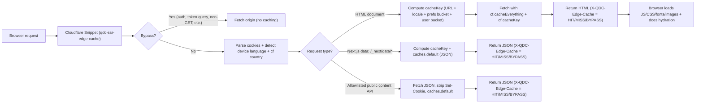

# QF-318 — SSR Personalization + Edge Caching (Cloudflare Snippet): E2E Flow

This doc explains **what happens from the moment a URL is requested** until the page finishes
loading, in both:

- **Plain English** (non-technical)
- **Technical** terms (for implementation/debugging)

The edge logic lives in `cloudflare/snippets/qdc-ssr-edge-cache.js`.

---

## Approach summary (30 seconds)

We make **SSR personalization first-class** by reading a compact preferences cookie (`QDC_PREFS`) on
the server, then we let **Cloudflare Snippets cache HTML and key JSON** at the edge using a **cache
key that includes locale + preference-set hash**. This makes both **guest** and **logged‑in** users
fast **without leaking private data**, while still honoring QF‑318’s country/device-language rules.

---

## Plain English (non-technical)

1. Your browser asks for a page (like `ssr.quran.com/vi/5`).
2. Cloudflare looks at a few “labels” that come with the request:
   - **language** (from the URL and your browser settings)
   - **country** (from your IP)
   - **your settings** (from cookies, like font/translation choices)
3. Cloudflare uses those labels to decide:
   - “Can I serve a saved copy?” (**cache HIT**) → fast
   - “Do I need to ask the server?” (**cache MISS**) → slower once, then saved
   - “This is sensitive (login/auth)” → never saved (**BYPASS**)
4. When Cloudflare does need to ask the server, the server still renders the page with your settings
   **immediately** (SSR) using cookies.
5. Next time you (or anyone with the same settings) asks for the same page, Cloudflare can serve the
   saved version from the edge.

---

## Technical E2E Architecture

### Key cookies (inputs)

- `NEXT_LOCALE=<locale>`: Next.js locale routing hint.
- `QDC_MANUAL_LOCALE=1`: user explicitly picked a language (prevents auto-detection redirects).
- `QDC_PREFS=<base64url(JSON)>`: SSR-relevant preferences snapshot.
- `QDC_PREFS_KEY=<shortHash>`: stable hash of `QDC_PREFS` (cache bucket key).
- `id=<...>`: auth/user cookie used to isolate private pages (hashed to `userKey`).

### Key request headers (inputs)

- `Accept: text/html` or `Sec-Fetch-Dest: document` → document navigation (HTML).
- `Accept-Language: ...` → device language detection.
- `request.cf.country` → country detection at edge.

---

## Flow Diagram (high level)

---

## Technical: step-by-step

### 1) Snippet gating / safety

The snippet only runs caching logic when:

- `http.host === ssr.quran.com`
- request method is `GET`
- request is not an auth/token flow (e.g. `/auth`, `/logout`, or `?token=...`)

Otherwise it passes through to origin (**BYPASS**).

### 2) Compute “inputs that affect SSR output”

For each request, the snippet computes:

- `urlLocale`: locale prefix in the URL (e.g. `/vi/5` → `vi`)
- `hasManualSelection`: `QDC_MANUAL_LOCALE=1`
- `prefsKey`: from `QDC_PREFS_KEY` (preference-set bucketing)
- `deviceLanguage`: from `Accept-Language` (base tag)
- `cfCountry`: from `request.cf.country`
- `localeForPreferences`:
  - if manual selection → use `urlLocale`/`NEXT_LOCALE`
    - default locale (`en`) does **not** get forced into the path (no `/en/...` redirect)
  - else → `deviceLanguage`
- `countryForPreferences` (QF‑318 rule):
  - if `localeForPreferences` is `en` or unsupported → real `cfCountry`
  - else → `US`
- `userKey`:
  - only for private routes
  - derived from the `id` cookie (hashed)

### 3) Decide caching strategy by route type

#### A) HTML document navigations (SSR HTML)

- Cache key: normalized URL + `localeKey` + either:
  - `prefsKey` (preferred when present), or
  - guest bucket (`localeForPreferences` + `countryForPreferences`)
  - plus `userKey` for private paths

The snippet uses Cloudflare’s built-in caching for HTML:

- `cf.cacheEverything: true`
- `cf.cacheKey: <our computed key>`
- `cf.cacheTtlByStatus: { 200-299: 3600s, 301-308: 0, 400+: 0 }` (we **do not** cache origin
  redirects here)

This is what makes document responses return `cf-cache-status: HIT` and fast `cfEdge;dur=...`.

#### B) `/_next/data/*` JSON

These requests are cached via `caches.default` (safe JSON cache path) using the same bucketing
rules.

#### C) Public content API (strict allowlist)

Some public endpoints are cached with `caches.default`. We strip `Set-Cookie` before caching because
upstream can return irrelevant cookies that would force BYPASS.

### 4) Origin SSR uses cookies to render correct first paint

Even on a MISS, the SSR server should render with the user’s preferences **immediately**:

- `src/utils/withSsrRedux.ts` reads `QDC_PREFS`
- dispatches `syncUserPreferences(...)`
- SSR HTML reflects the settings without waiting for client-side fetching

### 5) Browser finishes load (and why it can still feel “slow”)

Even when HTML is a HIT, the browser still downloads:

- JS bundles (`/_next/static/*`) → usually cached by Cloudflare automatically
- images / `/_next/image` → can revalidate or be slower
- third-party calls (e.g., Sentry) → not cacheable
- some auth endpoints (e.g. `/api/proxy/auth/*`) → intentionally BYPASS

---

## Concrete examples

### Example 1 — Guest, first visit

1. Browser requests `/`.
2. Snippet determines device language + country → chooses a “guest bucket”.
3. Redirect happens to the locale route.
4. First HTML is a MISS (once), then becomes HIT for the same bucket.

### Example 2 — Returning guest with preferences cookie

1. Browser requests `/vi/5`.
2. Cookie contains `QDC_PREFS_KEY=abcd123`.
3. Cache key becomes `URL + locale + prefsKey`.
4. HTML can be a HIT (shared by anyone with the same preference set).

### Example 3 — Logged-in user, private page

1. Browser requests `/vi/profile`.
2. Snippet marks it as private and adds `userKey` (derived from `id` cookie).
3. Cache key becomes `URL + locale + prefsKey + userKey` (per-user isolation).

---

## Debugging / verification

### Quick checks

- `BASE_URL=https://ssr.quran.com LOCALE=vi bash scripts/qf-318/edge-cache-smoke.sh`
- `BASE_URL=https://ssr.quran.com PATHS='/ /5 /vi /vi/5' RUNS=2 bash scripts/qf-318/edge-live-debug.sh`
- `HEADLESS=1 RUNS=1 URLS='https://ssr.quran.com/ https://ssr.quran.com/vi https://ssr.quran.com/vi/5' node scripts/qf-318/real-world-browser-report.mjs`

### Headers to watch

- `X-QDC-Edge-Cache: HIT|MISS|BYPASS`
- `X-QDC-Edge-Cache-Key: ...`
- `CF-Cache-Status: HIT|MISS|BYPASS`
- `Age: <seconds>` (when HIT)

Reports are written to `test-results/qf-318-real-world/`.

---

## Which tests validate each step

### Local deterministic (MSW)

- QF‑318 defaults + language rules:
  - `tests/integration/localization/qdc-localization.spec.ts`
  - `tests/integration/qf-318-product/change-language-when-customised.spec.ts`
  - `tests/integration/qf-318-product/change-language-when-not-customised.spec.ts`
  - `tests/integration/qf-318-product/reset-settings.spec.ts`
- SSR cookie snapshot:
  - `tests/integration/qf-318-cache/qf-318-ssr-prefs-cookie.spec.ts`
- Manual locale cookie set:
  - `tests/integration/qf-318-cache/qf-318-manual-locale-cookie.spec.ts`

### Production edge smoke (safe)

- Public HTML cache HIT:
  - `tests/integration/qf-318-edge/edge-public-cache-hit.spec.ts`
- Manual locale root redirect:
  - `tests/integration/qf-318-edge/edge-manual-locale-root-redirect.spec.ts`
- `/_next/data` cache:
  - `tests/integration/qf-318-edge/edge-next-data-cache-hit.spec.ts`
- Allowlisted content API cache:
  - `tests/integration/qf-318-edge/edge-content-api-cache-hit.spec.ts`
- Auth routes bypass:
  - `tests/integration/qf-318-edge/edge-auth-bypass.spec.ts`
- Private isolation (cache key):
  - `tests/integration/qf-318-edge/edge-private-cache-key.spec.ts`
- SSR prefs applied:
  - `tests/integration/qf-318-edge/edge-ssr-prefs-applied.spec.ts`
- No user identity leakage on public pages:
  - `tests/integration/qf-318-edge/edge-public-no-user-leak.spec.ts`

### Production product smoke (mutating + cleanup)

- `tests/integration/qf-318-prod-product/prod-product.spec.ts`
