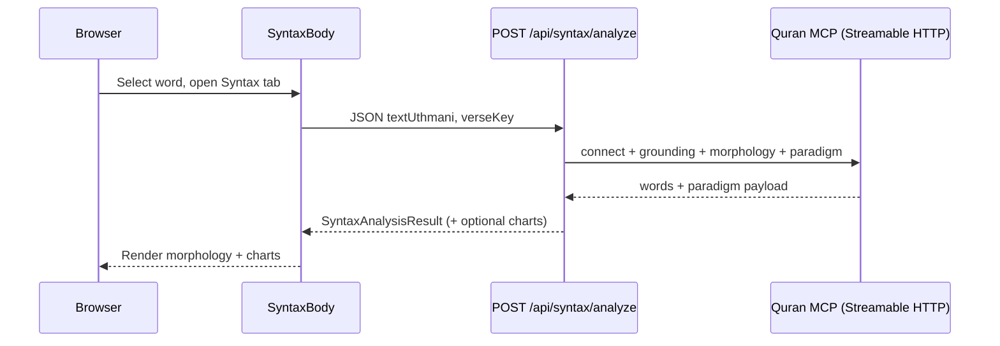

# Syntax analysis & Study Mode — design notes

This document describes the feature work on the **current branch** compared to **`origin/production`**: a new **Syntax** experience in Quran Reader **Study Mode**, backed by a **Next.js API route** that calls **Quran MCP** for morphology (and optional paradigm-derived charts).

**Baseline:** `git diff origin/production...HEAD`  
**External reference:** [Quran MCP documentation](https://mcp.quran.ai/documentation) (Streamable HTTP, `fetch_grounding_rules`, `fetch_word_morphology`, `fetch_word_paradigm`).

---

## 1. Summary

| Area | Change |
|------|--------|
| **Study Mode** | New bottom tab **`syntax`** with search-style icon; opens grammatical analysis for the **selected word** in the verse. |
| **UI** | New **Syntax** view: layout/skeleton, morphology text, optional **sarf / verb / ism** charts (types in `types/SyntaxAnalysis.ts`). |
| **API** | `POST /api/syntax/analyze` — validates input, calls server-side Quran MCP client, returns `SyntaxAnalysisResult`. |
| **Data** | Morphology from MCP mapped to `rootLetter`, `pattern`, `wordBreakDown`; paradigm stems optionally merged into charts via `syntaxChartsFromMcp` + `syntaxAnalysisCharts`. |
| **Mock** | `NEXT_PUBLIC_SYNTAX_ANALYSIS_MOCK=true` skips MCP and returns `syntaxAnalysis.mock.ts`. |
| **Infra / other** | `@modelcontextprotocol/sdk` dependency; TS path alias for MCP ESM; Verse font tweak in tafsir/translation mode. `middleware.ts` and `url.ts` match **`origin/production`** (no Syntax-specific edits). |

---

## 2. User-facing flow (Study Mode)

1. User opens **Study Mode** on a verse (existing flow).
2. User selects a **word** in the verse (word tap / selection used elsewhere for tafsir, etc.).
3. User taps the **Syntax** tab (icon: `public/icons/search.svg`, same `color` pattern as Tafsir’s `BookIcon`).
4. **`StudyModeSyntaxTab`** loads **`SyntaxBody`** (dynamic import + skeleton).
5. **`SyntaxBody`** uses **SWR** with a key derived from `selectedWord` location, Uthmani text, and `verseKey`.
6. **`fetchSyntaxAnalysis`** posts to **`/api/syntax/analyze`** unless mock mode is on.
7. Response drives **morphology** copy and **`SyntaxAnalysisCharts`** when `verb*`, `sarfChart`, or `ismChart` are present and pass normalization.

**Key files:** `StudyModeBottomActions` (`StudyModeTabId.SYNTAX`), `StudyModeBodyTabs.tsx`, `StudyModeBody.tsx`, `StudyModeModal/index.tsx`, `tabs/StudyModeSyntaxTab.tsx`, `SyntaxView/*`.

---

## 3. API: `POST /api/syntax/analyze`

| Item | Detail |
|------|--------|
| **Path** | `/api/syntax/analyze` |
| **File** | `src/pages/api/syntax/analyze.ts` |
| **Method** | `POST` only (`405` otherwise). |
| **Body (JSON)** | `{ "textUthmani": string, "verseKey"?: string }` |
| **Validation** | `textUthmani` required, non-empty after trim; max length **200** characters. |
| **Success** | `200` + `SyntaxAnalysisResult` |
| **Errors** | `400` (bad input), `502` + `{ error: string }` (MCP failure / thrown error). |

**`verseKey` format:** When present, should match `surah:ayah` (e.g. `2:255`) so morphology and paradigm calls can use **ayah-scoped** MCP arguments (see `isValidAyahKey` in morphology helper).

**Client:** `src/services/syntaxAnalysisService.ts` — `fetch('/api/syntax/analyze', { method: 'POST', ... })`, throws `Error` with server message when `!res.ok` or body contains `error`.

---

## 4. Quran MCP server flow

All MCP calls run **on the server** inside `fetchSyntaxAnalysisViaQuranMcp` (`src/lib/syntaxAnalysisQuranMcp.ts`) so the browser never holds MCP transport credentials beyond same-origin API.

### 4.1 Connection

- **Transport:** `@modelcontextprotocol/sdk` `StreamableHTTPClientTransport`.
- **URL:** `process.env.QURAN_SYNTAX_MCP_URL` or default `https://mcp.quran.ai/` (trailing slash normalized).
- **Client name:** `quran.com-frontend` (version `1.0.0`).

### 4.2 Tool sequence (`runMcpSyntaxStudyOnClient` in `syntaxAnalysisQuranMcpMorphology.ts`)

1. **`fetch_grounding_rules`** — session grounding per Quran MCP docs.
2. **`fetch_word_morphology`**
   - If `verseKey` is valid `surah:ayah`: arguments `ayah_key`, `word_text`.
   - Else: argument `word` = Uthmani text.
3. **Parse** structured payload → `words[]`; **pick** row matching `textUthmani` (`pickMorphologyWord`).
4. **`fetch_word_paradigm`** (best-effort; may return `null` on error)
   - If valid ayah key: `ayah_key` + `word_text`.
   - Else: `lemma` from picked word when available.
5. **Return bundle:** `base` (`SyntaxAnalysisResult` from morphology), `pickedWord`, `morphologyResponse`, `paradigm`.

### 4.3 Mapping morphology → `SyntaxAnalysisResult`

- **`morphologyWordToSyntaxResult`:** builds `rootLetter`, `pattern` (English line from `description` / `grammatical_features`, Arabic-ish `patternType` from POS/aspect/case), `wordBreakDown` from `morpheme_segments` or whole word + translation.

### 4.4 Optional charts

- **`syntaxChartsFromMcp.ts`** — builds partial chart objects from **paradigm** stems (`perfect` / `imperfect` / `imperative`) and picked word metadata where applicable.
- **`syntaxAnalysisCharts.ts`** — `applyOptionalChartsToResult`, `normalizeSarfChart`, `normalizeVerbChart`, `normalizeIsmChart`, and verb present/past merge rules aligned with the UI tables.

`fetchSyntaxAnalysisViaQuranMcp` merges: `applyOptionalChartsToResult(bundle.base, buildOptionalChartsFromMcp(bundle.pickedWord, bundle.paradigm))`.

---

## 5. Types & UI charts

- **`types/SyntaxAnalysis.ts`** — `SyntaxAnalysisResult` and optional `sarfChart`, `verbPresentTenseChart`, `verbPastTenseChart`, `verbChart`, `ismChart`.
- **`SyntaxChartTables.tsx`** — renders grids when props are defined.
- **`useSyntaxChartArabicTypography.ts`** — shared Arabic typography for Syntax view.

---

## 6. Configuration & mock

| Variable | Role |
|----------|------|
| `QURAN_SYNTAX_MCP_URL` | Optional override for MCP Streamable HTTP base URL. |
| `NEXT_PUBLIC_SYNTAX_ANALYSIS_MOCK` | When `true`, client returns `SYNTAX_ANALYSIS_MOCK_RESPONSE` (no `/api/syntax/analyze` call). |

Documented in `.env.example` (syntax / MCP section).

---

## 7. Middleware & URL utilities (current behavior, same as production)

These files are **not** part of the Syntax feature contract. They are documented here because an earlier branch revision briefly changed them; the **current** sources match **`origin/production`**.

### 7.1 `src/middleware.ts`

| Behavior | Detail |
|----------|--------|
| **`_next/data` requests** | If `req.url` includes `_next/data`, respond with **`404`** and an empty body. Intended to force a **full page reload** after a new deployment instead of serving stale client-side navigation payloads. Applies in **all** environments (including local `yarn dev`), not gated on `NODE_ENV`. |
| **Ramadan routes** | Paths containing `/ramadan2026` or `/ramadanchallenge` (case-insensitive) redirect to the **lowercase** pathname when the URL is not already lowercase. |
| **Everything else** | `NextResponse.next()`. |

**Implication for local dev:** Client transitions that rely on `_next/data` JSON may get `404` from middleware; a hard refresh or full navigation is expected after deploys. This is unrelated to `/api/syntax/analyze`.

### 7.2 `src/utils/url.ts`

`getProxiedServiceUrl(service, path)` builds backend URLs for Quran Foundation services. There is **no** special branch for `QuranFoundationService.CONTENT` that bypasses the app proxy.

| Condition | Base URL |
|-----------|----------|
| **Static build** (`isStaticBuild`) | `${API_GATEWAY_URL}/${service}${path}` |
| **Otherwise** | `${getBasePath()}/api/proxy/${service}${path}` where `getBasePath()` is `http://` or `https://` + `NEXT_PUBLIC_VERCEL_URL` depending on `NEXT_PUBLIC_VERCEL_ENV === 'development'`. |

All services in `QuranFoundationService` (`search`, `auth`, `content`, `quran-reflect`) use the same proxy pattern. Syntax analysis does **not** call this helper; it uses **`POST /api/syntax/analyze`** → Quran MCP on the server.

### 7.3 Other branch diffs (Syntax-related infra)

- **`tsconfig.json`** — path alias `@modelcontextprotocol/sdk/*` → ESM dist (bundler resolution).
- **`package.json` / `yarn.lock`** — adds `@modelcontextprotocol/sdk`.
- **`VerseText.module.scss`** — mobile `tafsirOrTranslationMode` font scale factor adjusted (`1.2` → `0.75` of `--font-size`).

---

## 8. File change list (`origin/production...HEAD`)

| Status | Path | Short description |
|--------|------|---------------------|
| M | `.env.example` | Document Quran MCP URL and syntax mock flag. |
| M | `package.json` | Add `@modelcontextprotocol/sdk`. |
| M | `yarn.lock` | Lockfile for new dependency. |
| M | `tsconfig.json` | MCP SDK path alias. |
| M | `src/components/Verse/VerseText.module.scss` | Tafsir/translation mode font sizing tweak. |
| M | `src/components/QuranReader/ReadingView/StudyModeModal/StudyModeBody.tsx` | Wire Syntax tab panel / props (e.g. `selectedWord`). |
| M | `src/components/QuranReader/ReadingView/StudyModeModal/StudyModeBodyTabs.tsx` | Register `StudyModeSyntaxTab`, tab config, **Search** icon for Syntax. |
| M | `src/components/QuranReader/ReadingView/StudyModeModal/StudyModeBottomActions/index.tsx` | Add `StudyModeTabId.SYNTAX`. |
| M | `src/components/QuranReader/ReadingView/StudyModeModal/index.tsx` | Study Mode state / layout for Syntax tab. |
| A | `.../tabs/StudyModeSyntaxTab.tsx` | Lazy tab shell: scroll container + dynamic `SyntaxBody`. |
| A | `src/components/QuranReader/SyntaxView/SyntaxBody.tsx` | SWR + morphology UI + charts. |
| A | `src/components/QuranReader/SyntaxView/SyntaxChartTables.tsx` | Sarf / verb / ism tables. |
| A | `src/components/QuranReader/SyntaxView/SyntaxSkeleton.tsx` | Loading UI for dynamic import. |
| A | `src/components/QuranReader/SyntaxView/SyntaxSkeleton.module.scss` | Skeleton styles. |
| A | `src/components/QuranReader/SyntaxView/SyntaxTabLayout.tsx` | Shared tab layout / scroll hook export. |
| A | `src/components/QuranReader/SyntaxView/SyntaxTabLayout.module.scss` | Layout styles. |
| A | `src/components/QuranReader/SyntaxView/SyntaxView.module.scss` | Syntax body styles. |
| A | `src/components/QuranReader/SyntaxView/useSyntaxChartArabicTypography.ts` | Arabic font helpers for charts/body. |
| A | `src/lib/syntaxAnalysisCharts.ts` | Normalize + merge optional charts onto base result. |
| A | `src/lib/syntaxAnalysisQuranMcp.ts` | MCP client connect + fetch bundle + merge charts. |
| A | `src/lib/syntaxAnalysisQuranMcpMorphology.ts` | MCP tool calls, pick word, map to `SyntaxAnalysisResult`. |
| A | `src/lib/syntaxChartsFromMcp.ts` | Build chart-shaped JSON from paradigm + picked word. |
| A | `src/pages/api/syntax/analyze.ts` | POST API handler calling `fetchSyntaxAnalysisViaQuranMcp`. |
| A | `src/services/syntaxAnalysis.mock.ts` | Full mock `SyntaxAnalysisResult` for local UI. |
| A | `src/services/syntaxAnalysisService.ts` | Client fetch + mock gate + `getWordTextUthmaniForSyntax`. |
| A | `types/SyntaxAnalysis.ts` | Shared TS types for API + UI. |

---

## 9. Diagram (high level)

---

## 10. Maintenance notes

- Regenerate this file list anytime with:  
  `git fetch origin production && git diff --name-status origin/production...HEAD`
- If MCP tools or response shapes change upstream, update **`syntaxAnalysisQuranMcpMorphology.ts`** and **`syntaxChartsFromMcp.ts`** together so the API contract in **`types/SyntaxAnalysis.ts`** stays satisfied.
